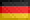
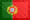
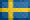

# GRF Badges

Documentation built at 2024-10-15 17:49:32.145604

## Classes

| Prefix | Name |
| ------ | ---- |
| `flag` | [Country/Region](#c_flag) |
| `mode` | [Usage](#c_mode) |
| `operator` | [Operator](#c_operator) |
| `power` | [Propulsion](#c_power) |

## Badges

### Country/Region

| Icon | Label | Description |   |
| ---- | ----- | ----------- | - |
|  | <a name="b_<built-in function hex>"></a>`flag/AD` | Andorra | [#](#b_flag/AD) |
|  | <a name="b_<built-in function hex>"></a>`flag/AE` | United Arab Emirates | [#](#b_flag/AE) |
|  | <a name="b_<built-in function hex>"></a>`flag/AF` | Afghanistan | [#](#b_flag/AF) |
|  | <a name="b_<built-in function hex>"></a>`flag/AG` | Antigua and Barbuda | [#](#b_flag/AG) |
|  | <a name="b_<built-in function hex>"></a>`flag/AI` | Anguilla | [#](#b_flag/AI) |
|  | <a name="b_<built-in function hex>"></a>`flag/AL` | Albania | [#](#b_flag/AL) |
|  | <a name="b_<built-in function hex>"></a>`flag/AM` | Armenia | [#](#b_flag/AM) |
|  | <a name="b_<built-in function hex>"></a>`flag/AO` | Angola | [#](#b_flag/AO) |
|  | <a name="b_<built-in function hex>"></a>`flag/AQ` | Antarctica | [#](#b_flag/AQ) |
|  | <a name="b_<built-in function hex>"></a>`flag/AR` | Argentina | [#](#b_flag/AR) |
|  | <a name="b_<built-in function hex>"></a>`flag/ARAB` | Arab League | [#](#b_flag/ARAB) |
|  | <a name="b_<built-in function hex>"></a>`flag/AS` | American Samoa | [#](#b_flag/AS) |
|  | <a name="b_<built-in function hex>"></a>`flag/AT` | Austria | [#](#b_flag/AT) |
|  | <a name="b_<built-in function hex>"></a>`flag/AU` | Australia | [#](#b_flag/AU) |
|  | <a name="b_<built-in function hex>"></a>`flag/AW` | Aruba | [#](#b_flag/AW) |
|  | <a name="b_<built-in function hex>"></a>`flag/AX` | Åland | [#](#b_flag/AX) |
|  | <a name="b_<built-in function hex>"></a>`flag/AZ` | Azerbaijan | [#](#b_flag/AZ) |
|  | <a name="b_<built-in function hex>"></a>`flag/BA` | Bosnia and Herzegovina | [#](#b_flag/BA) |
|  | <a name="b_<built-in function hex>"></a>`flag/BB` | Barbados | [#](#b_flag/BB) |
|  | <a name="b_<built-in function hex>"></a>`flag/BD` | Bangladesh | [#](#b_flag/BD) |
|  | <a name="b_<built-in function hex>"></a>`flag/BE` | Belgium | [#](#b_flag/BE) |
|  | <a name="b_<built-in function hex>"></a>`flag/BF` | Burkina Faso | [#](#b_flag/BF) |
|  | <a name="b_<built-in function hex>"></a>`flag/BG` | Bulgaria | [#](#b_flag/BG) |
|  | <a name="b_<built-in function hex>"></a>`flag/BH` | Bahrain | [#](#b_flag/BH) |
|  | <a name="b_<built-in function hex>"></a>`flag/BI` | Burundi | [#](#b_flag/BI) |
|  | <a name="b_<built-in function hex>"></a>`flag/BJ` | Benin | [#](#b_flag/BJ) |
|  | <a name="b_<built-in function hex>"></a>`flag/BL` | Saint Barthélemy | [#](#b_flag/BL) |
|  | <a name="b_<built-in function hex>"></a>`flag/BM` | Bermuda | [#](#b_flag/BM) |
|  | <a name="b_<built-in function hex>"></a>`flag/BN` | Brunei | [#](#b_flag/BN) |
|  | <a name="b_<built-in function hex>"></a>`flag/BO` | Bolivia | [#](#b_flag/BO) |
|  | <a name="b_<built-in function hex>"></a>`flag/BQ` | Caribbean Netherlands | [#](#b_flag/BQ) |
|  | <a name="b_<built-in function hex>"></a>`flag/BR` | Brazil | [#](#b_flag/BR) |
|  | <a name="b_<built-in function hex>"></a>`flag/BS` | Bahamas | [#](#b_flag/BS) |
|  | <a name="b_<built-in function hex>"></a>`flag/BT` | Bhutan | [#](#b_flag/BT) |
|  | <a name="b_<built-in function hex>"></a>`flag/BV` | Bouvet Island | [#](#b_flag/BV) |
|  | <a name="b_<built-in function hex>"></a>`flag/BW` | Botswana | [#](#b_flag/BW) |
|  | <a name="b_<built-in function hex>"></a>`flag/BY` | Belarus | [#](#b_flag/BY) |
|  | <a name="b_<built-in function hex>"></a>`flag/BZ` | Belize | [#](#b_flag/BZ) |
|  | <a name="b_<built-in function hex>"></a>`flag/CA` | Canada | [#](#b_flag/CA) |
|  | <a name="b_<built-in function hex>"></a>`flag/CC` | Cocos Islands | [#](#b_flag/CC) |
|  | <a name="b_<built-in function hex>"></a>`flag/CD` | Democratic Republic of the Congo | [#](#b_flag/CD) |
|  | <a name="b_<built-in function hex>"></a>`flag/CEFTA` | (Central European Free Trade Agreement) | [#](#b_flag/CEFTA) |
|  | <a name="b_<built-in function hex>"></a>`flag/CF` | Central African Republic | [#](#b_flag/CF) |
|  | <a name="b_<built-in function hex>"></a>`flag/CG` | Republic of the Congo | [#](#b_flag/CG) |
|  | <a name="b_<built-in function hex>"></a>`flag/CH` | Switzerland | [#](#b_flag/CH) |
|  | <a name="b_<built-in function hex>"></a>`flag/CI` | Ivory Coast | [#](#b_flag/CI) |
|  | <a name="b_<built-in function hex>"></a>`flag/CK` | Cook Islands | [#](#b_flag/CK) |
|  | <a name="b_<built-in function hex>"></a>`flag/CL` | Chile | [#](#b_flag/CL) |
|  | <a name="b_<built-in function hex>"></a>`flag/CM` | Cameroon | [#](#b_flag/CM) |
|  | <a name="b_<built-in function hex>"></a>`flag/CN` | China | [#](#b_flag/CN) |
|  | <a name="b_<built-in function hex>"></a>`flag/CO` | Colombia | [#](#b_flag/CO) |
|  | <a name="b_<built-in function hex>"></a>`flag/CP` | (Clipperton Island) | [#](#b_flag/CP) |
|  | <a name="b_<built-in function hex>"></a>`flag/CR` | Costa Rica | [#](#b_flag/CR) |
|  | <a name="b_<built-in function hex>"></a>`flag/CU` | Cuba | [#](#b_flag/CU) |
|  | <a name="b_<built-in function hex>"></a>`flag/CV` | Cape Verde | [#](#b_flag/CV) |
|  | <a name="b_<built-in function hex>"></a>`flag/CW` | Curaçao | [#](#b_flag/CW) |
|  | <a name="b_<built-in function hex>"></a>`flag/CX` | Christmas Island | [#](#b_flag/CX) |
|  | <a name="b_<built-in function hex>"></a>`flag/CY` | Cyprus | [#](#b_flag/CY) |
|  | <a name="b_<built-in function hex>"></a>`flag/CZ` | Czech Republic | [#](#b_flag/CZ) |
|  | <a name="b_<built-in function hex>"></a>`flag/DE` | Germany | [#](#b_flag/DE) |
|  | <a name="b_<built-in function hex>"></a>`flag/DG` | (Diego Garcia) | [#](#b_flag/DG) |
|  | <a name="b_<built-in function hex>"></a>`flag/DJ` | Djibouti | [#](#b_flag/DJ) |
|  | <a name="b_<built-in function hex>"></a>`flag/DK` | Denmark | [#](#b_flag/DK) |
|  | <a name="b_<built-in function hex>"></a>`flag/DM` | Dominica | [#](#b_flag/DM) |
|  | <a name="b_<built-in function hex>"></a>`flag/DO` | Dominican Republic | [#](#b_flag/DO) |
|  | <a name="b_<built-in function hex>"></a>`flag/DZ` | Algeria | [#](#b_flag/DZ) |
|  | <a name="b_<built-in function hex>"></a>`flag/EAC` | (East African Community) | [#](#b_flag/EAC) |
|  | <a name="b_<built-in function hex>"></a>`flag/EC` | Ecuador | [#](#b_flag/EC) |
|  | <a name="b_<built-in function hex>"></a>`flag/EE` | Estonia | [#](#b_flag/EE) |
|  | <a name="b_<built-in function hex>"></a>`flag/EG` | Egypt | [#](#b_flag/EG) |
|  | <a name="b_<built-in function hex>"></a>`flag/EH` | Western Sahara | [#](#b_flag/EH) |
|  | <a name="b_<built-in function hex>"></a>`flag/ER` | Eritrea | [#](#b_flag/ER) |
|  | <a name="b_<built-in function hex>"></a>`flag/ES` | Spain | [#](#b_flag/ES) |
|  | <a name="b_<built-in function hex>"></a>`flag/ES/CT` | Spain (Catalonia) | [#](#b_flag/ES/CT) |
|  | <a name="b_<built-in function hex>"></a>`flag/ES/GA` | Spain (Galicia) | [#](#b_flag/ES/GA) |
|  | <a name="b_<built-in function hex>"></a>`flag/ES/PV` | Spain (Basque Country) | [#](#b_flag/ES/PV) |
|  | <a name="b_<built-in function hex>"></a>`flag/ET` | Ethiopia | [#](#b_flag/ET) |
|  | <a name="b_<built-in function hex>"></a>`flag/EU` | European Union | [#](#b_flag/EU) |
|  | <a name="b_<built-in function hex>"></a>`flag/FI` | Finland | [#](#b_flag/FI) |
|  | <a name="b_<built-in function hex>"></a>`flag/FJ` | Fiji | [#](#b_flag/FJ) |
|  | <a name="b_<built-in function hex>"></a>`flag/FK` | Falkland Islands | [#](#b_flag/FK) |
|  | <a name="b_<built-in function hex>"></a>`flag/FM` | Micronesia | [#](#b_flag/FM) |
|  | <a name="b_<built-in function hex>"></a>`flag/FO` | Faroe Islands | [#](#b_flag/FO) |
|  | <a name="b_<built-in function hex>"></a>`flag/FR` | France | [#](#b_flag/FR) |
|  | <a name="b_<built-in function hex>"></a>`flag/GA` | Andorra | [#](#b_flag/GA) |
|  | <a name="b_<built-in function hex>"></a>`flag/GB` | United Kingdom | [#](#b_flag/GB) |
|  | <a name="b_<built-in function hex>"></a>`flag/GB/england` | England | [#](#b_flag/GB/england) |
|  | <a name="b_<built-in function hex>"></a>`flag/GB/northern ireland` | Northern Ireland | [#](#b_flag/GB/northern ireland) |
|  | <a name="b_<built-in function hex>"></a>`flag/GB/scotland` | Scotland | [#](#b_flag/GB/scotland) |
|  | <a name="b_<built-in function hex>"></a>`flag/GB/wales` | Wales | [#](#b_flag/GB/wales) |
|  | <a name="b_<built-in function hex>"></a>`flag/GD` | Grenada | [#](#b_flag/GD) |
|  | <a name="b_<built-in function hex>"></a>`flag/GE` | Georgia | [#](#b_flag/GE) |
|  | <a name="b_<built-in function hex>"></a>`flag/GF` | French Guiana | [#](#b_flag/GF) |
|  | <a name="b_<built-in function hex>"></a>`flag/GG` | Guernsey | [#](#b_flag/GG) |
|  | <a name="b_<built-in function hex>"></a>`flag/GH` | Ghana | [#](#b_flag/GH) |
|  | <a name="b_<built-in function hex>"></a>`flag/GI` | Gibraltar | [#](#b_flag/GI) |
|  | <a name="b_<built-in function hex>"></a>`flag/GL` | Greenland | [#](#b_flag/GL) |
|  | <a name="b_<built-in function hex>"></a>`flag/GM` | Gambia | [#](#b_flag/GM) |
|  | <a name="b_<built-in function hex>"></a>`flag/GN` | Guinea | [#](#b_flag/GN) |
|  | <a name="b_<built-in function hex>"></a>`flag/GP` | Guadeloupe | [#](#b_flag/GP) |
|  | <a name="b_<built-in function hex>"></a>`flag/GQ` | Equatorial Guinea | [#](#b_flag/GQ) |
|  | <a name="b_<built-in function hex>"></a>`flag/GR` | Greece | [#](#b_flag/GR) |
|  | <a name="b_<built-in function hex>"></a>`flag/GS` | South Georgia and the South Sandwich Islands | [#](#b_flag/GS) |
|  | <a name="b_<built-in function hex>"></a>`flag/GT` | Gautemala | [#](#b_flag/GT) |
|  | <a name="b_<built-in function hex>"></a>`flag/GU` | Guam | [#](#b_flag/GU) |
|  | <a name="b_<built-in function hex>"></a>`flag/GW` | Guinea-Bissau | [#](#b_flag/GW) |
|  | <a name="b_<built-in function hex>"></a>`flag/GY` | Guyana | [#](#b_flag/GY) |
|  | <a name="b_<built-in function hex>"></a>`flag/HK` | Hong Kong | [#](#b_flag/HK) |
|  | <a name="b_<built-in function hex>"></a>`flag/HM` | Heard Island and McDonald Islands | [#](#b_flag/HM) |
|  | <a name="b_<built-in function hex>"></a>`flag/HN` | Honduras | [#](#b_flag/HN) |
|  | <a name="b_<built-in function hex>"></a>`flag/HR` | Croatia | [#](#b_flag/HR) |
|  | <a name="b_<built-in function hex>"></a>`flag/HT` | Haiti | [#](#b_flag/HT) |
|  | <a name="b_<built-in function hex>"></a>`flag/HU` | Hungary | [#](#b_flag/HU) |
|  | <a name="b_<built-in function hex>"></a>`flag/IC` | Canary Islands | [#](#b_flag/IC) |
|  | <a name="b_<built-in function hex>"></a>`flag/ID` | Indonesia | [#](#b_flag/ID) |
|  | <a name="b_<built-in function hex>"></a>`flag/IE` | Ireland | [#](#b_flag/IE) |
|  | <a name="b_<built-in function hex>"></a>`flag/IL` | Israel | [#](#b_flag/IL) |
|  | <a name="b_<built-in function hex>"></a>`flag/IM` | Isle of Man | [#](#b_flag/IM) |
|  | <a name="b_<built-in function hex>"></a>`flag/IN` | India | [#](#b_flag/IN) |
|  | <a name="b_<built-in function hex>"></a>`flag/IO` | British Indian Ocean Territory | [#](#b_flag/IO) |
|  | <a name="b_<built-in function hex>"></a>`flag/IQ` | Iraq | [#](#b_flag/IQ) |
|  | <a name="b_<built-in function hex>"></a>`flag/IR` | Iran | [#](#b_flag/IR) |
|  | <a name="b_<built-in function hex>"></a>`flag/IS` | Iceland | [#](#b_flag/IS) |
|  | <a name="b_<built-in function hex>"></a>`flag/IT` | Italy | [#](#b_flag/IT) |
|  | <a name="b_<built-in function hex>"></a>`flag/JE` | Jersey | [#](#b_flag/JE) |
|  | <a name="b_<built-in function hex>"></a>`flag/JM` | Jamaica | [#](#b_flag/JM) |
|  | <a name="b_<built-in function hex>"></a>`flag/JO` | Jordan | [#](#b_flag/JO) |
|  | <a name="b_<built-in function hex>"></a>`flag/JP` | Japan | [#](#b_flag/JP) |
|  | <a name="b_<built-in function hex>"></a>`flag/KE` | Kenya | [#](#b_flag/KE) |
|  | <a name="b_<built-in function hex>"></a>`flag/KG` | Kyrgyzstan | [#](#b_flag/KG) |
|  | <a name="b_<built-in function hex>"></a>`flag/KH` | Cambodia | [#](#b_flag/KH) |
|  | <a name="b_<built-in function hex>"></a>`flag/KI` | Kiribati | [#](#b_flag/KI) |
|  | <a name="b_<built-in function hex>"></a>`flag/KM` | Comoros | [#](#b_flag/KM) |
|  | <a name="b_<built-in function hex>"></a>`flag/KN` | Saint Kitts and Nevis | [#](#b_flag/KN) |
|  | <a name="b_<built-in function hex>"></a>`flag/KP` | North Korea | [#](#b_flag/KP) |
|  | <a name="b_<built-in function hex>"></a>`flag/KR` | South Korea | [#](#b_flag/KR) |
|  | <a name="b_<built-in function hex>"></a>`flag/KW` | Kuwait | [#](#b_flag/KW) |
|  | <a name="b_<built-in function hex>"></a>`flag/KY` | Cayman Islands | [#](#b_flag/KY) |
|  | <a name="b_<built-in function hex>"></a>`flag/KZ` | Kazakhstan | [#](#b_flag/KZ) |
|  | <a name="b_<built-in function hex>"></a>`flag/LA` | Lao | [#](#b_flag/LA) |
|  | <a name="b_<built-in function hex>"></a>`flag/LB` | Lebanon | [#](#b_flag/LB) |
|  | <a name="b_<built-in function hex>"></a>`flag/LC` | Saint Lucia | [#](#b_flag/LC) |
|  | <a name="b_<built-in function hex>"></a>`flag/LI` | Liechtenstein | [#](#b_flag/LI) |
|  | <a name="b_<built-in function hex>"></a>`flag/LK` | Sri Lanka | [#](#b_flag/LK) |
|  | <a name="b_<built-in function hex>"></a>`flag/LR` | Liberia | [#](#b_flag/LR) |
|  | <a name="b_<built-in function hex>"></a>`flag/LS` | Lesotho | [#](#b_flag/LS) |
|  | <a name="b_<built-in function hex>"></a>`flag/LT` | Lithuania | [#](#b_flag/LT) |
|  | <a name="b_<built-in function hex>"></a>`flag/LU` | Luxembourg | [#](#b_flag/LU) |
|  | <a name="b_<built-in function hex>"></a>`flag/LV` | Lativa | [#](#b_flag/LV) |
|  | <a name="b_<built-in function hex>"></a>`flag/LY` | Libya | [#](#b_flag/LY) |
|  | <a name="b_<built-in function hex>"></a>`flag/MA` | Morocco | [#](#b_flag/MA) |
|  | <a name="b_<built-in function hex>"></a>`flag/MC` | Monaco | [#](#b_flag/MC) |
|  | <a name="b_<built-in function hex>"></a>`flag/MD` | Moldova | [#](#b_flag/MD) |
|  | <a name="b_<built-in function hex>"></a>`flag/ME` | Montenegro | [#](#b_flag/ME) |
|  | <a name="b_<built-in function hex>"></a>`flag/MF` | Saint Martin | [#](#b_flag/MF) |
|  | <a name="b_<built-in function hex>"></a>`flag/MG` | Madagascar | [#](#b_flag/MG) |
|  | <a name="b_<built-in function hex>"></a>`flag/MH` | Marshall Islands | [#](#b_flag/MH) |
|  | <a name="b_<built-in function hex>"></a>`flag/MK` | North Macedonia | [#](#b_flag/MK) |
|  | <a name="b_<built-in function hex>"></a>`flag/ML` | Mali | [#](#b_flag/ML) |
|  | <a name="b_<built-in function hex>"></a>`flag/MM` | Myanmar | [#](#b_flag/MM) |
|  | <a name="b_<built-in function hex>"></a>`flag/MN` | Mongolia | [#](#b_flag/MN) |
|  | <a name="b_<built-in function hex>"></a>`flag/MO` | Macao | [#](#b_flag/MO) |
|  | <a name="b_<built-in function hex>"></a>`flag/MP` | Northern Mariana Islands | [#](#b_flag/MP) |
|  | <a name="b_<built-in function hex>"></a>`flag/MQ` | Martinique | [#](#b_flag/MQ) |
|  | <a name="b_<built-in function hex>"></a>`flag/MR` | Mauritania | [#](#b_flag/MR) |
|  | <a name="b_<built-in function hex>"></a>`flag/MS` | Montserrat | [#](#b_flag/MS) |
|  | <a name="b_<built-in function hex>"></a>`flag/MT` | Malta | [#](#b_flag/MT) |
|  | <a name="b_<built-in function hex>"></a>`flag/MU` | Mauritius | [#](#b_flag/MU) |
|  | <a name="b_<built-in function hex>"></a>`flag/MV` | Maldives | [#](#b_flag/MV) |
|  | <a name="b_<built-in function hex>"></a>`flag/MW` | Malawi | [#](#b_flag/MW) |
|  | <a name="b_<built-in function hex>"></a>`flag/MX` | Mexico | [#](#b_flag/MX) |
|  | <a name="b_<built-in function hex>"></a>`flag/MY` | Malaysia | [#](#b_flag/MY) |
|  | <a name="b_<built-in function hex>"></a>`flag/MZ` | Mozambique | [#](#b_flag/MZ) |
|  | <a name="b_<built-in function hex>"></a>`flag/NA` | Namibia | [#](#b_flag/NA) |
|  | <a name="b_<built-in function hex>"></a>`flag/NC` | New Caledonia | [#](#b_flag/NC) |
|  | <a name="b_<built-in function hex>"></a>`flag/NE` | Niger | [#](#b_flag/NE) |
|  | <a name="b_<built-in function hex>"></a>`flag/NF` | Norfolk Island | [#](#b_flag/NF) |
|  | <a name="b_<built-in function hex>"></a>`flag/NG` | Nigeria | [#](#b_flag/NG) |
|  | <a name="b_<built-in function hex>"></a>`flag/NI` | Nicaragua | [#](#b_flag/NI) |
|  | <a name="b_<built-in function hex>"></a>`flag/NL` | Netherlands | [#](#b_flag/NL) |
|  | <a name="b_<built-in function hex>"></a>`flag/NO` | Norway | [#](#b_flag/NO) |
|  | <a name="b_<built-in function hex>"></a>`flag/NP` | Nepal | [#](#b_flag/NP) |
|  | <a name="b_<built-in function hex>"></a>`flag/NR` | Nauru | [#](#b_flag/NR) |
|  | <a name="b_<built-in function hex>"></a>`flag/NU` | Niue | [#](#b_flag/NU) |
|  | <a name="b_<built-in function hex>"></a>`flag/NZ` | New Zealand | [#](#b_flag/NZ) |
|  | <a name="b_<built-in function hex>"></a>`flag/OM` | Oman | [#](#b_flag/OM) |
|  | <a name="b_<built-in function hex>"></a>`flag/PA` | Panama | [#](#b_flag/PA) |
|  | <a name="b_<built-in function hex>"></a>`flag/PC` | (Pacific Community) | [#](#b_flag/PC) |
|  | <a name="b_<built-in function hex>"></a>`flag/PE` | Peru | [#](#b_flag/PE) |
|  | <a name="b_<built-in function hex>"></a>`flag/PF` | French Polynesia | [#](#b_flag/PF) |
|  | <a name="b_<built-in function hex>"></a>`flag/PG` | Papua New Guinea | [#](#b_flag/PG) |
|  | <a name="b_<built-in function hex>"></a>`flag/PH` | Philippines | [#](#b_flag/PH) |
|  | <a name="b_<built-in function hex>"></a>`flag/PK` | Pakistan | [#](#b_flag/PK) |
|  | <a name="b_<built-in function hex>"></a>`flag/PL` | Poland | [#](#b_flag/PL) |
|  | <a name="b_<built-in function hex>"></a>`flag/PM` | Saint Pierre and Miquelon | [#](#b_flag/PM) |
|  | <a name="b_<built-in function hex>"></a>`flag/PN` | Pitcairn | [#](#b_flag/PN) |
|  | <a name="b_<built-in function hex>"></a>`flag/PR` | Puerto Rico | [#](#b_flag/PR) |
|  | <a name="b_<built-in function hex>"></a>`flag/PS` | Palestine | [#](#b_flag/PS) |
|  | <a name="b_<built-in function hex>"></a>`flag/PT` | Portugal | [#](#b_flag/PT) |
|  | <a name="b_<built-in function hex>"></a>`flag/PW` | Palau | [#](#b_flag/PW) |
|  | <a name="b_<built-in function hex>"></a>`flag/PY` | Paraguay | [#](#b_flag/PY) |
|  | <a name="b_<built-in function hex>"></a>`flag/QA` | Qatar | [#](#b_flag/QA) |
|  | <a name="b_<built-in function hex>"></a>`flag/RE` | Réunion | [#](#b_flag/RE) |
|  | <a name="b_<built-in function hex>"></a>`flag/RO` | Romania | [#](#b_flag/RO) |
|  | <a name="b_<built-in function hex>"></a>`flag/RS` | Serbia | [#](#b_flag/RS) |
|  | <a name="b_<built-in function hex>"></a>`flag/RU` | Russia | [#](#b_flag/RU) |
|  | <a name="b_<built-in function hex>"></a>`flag/RW` | Rwanda | [#](#b_flag/RW) |
|  | <a name="b_<built-in function hex>"></a>`flag/SA` | Saudi Arabia | [#](#b_flag/SA) |
|  | <a name="b_<built-in function hex>"></a>`flag/SB` | Solomon Islands | [#](#b_flag/SB) |
|  | <a name="b_<built-in function hex>"></a>`flag/SC` | Seychelles | [#](#b_flag/SC) |
|  | <a name="b_<built-in function hex>"></a>`flag/SD` | Sudan | [#](#b_flag/SD) |
|  | <a name="b_<built-in function hex>"></a>`flag/SE` | Sweden | [#](#b_flag/SE) |
|  | <a name="b_<built-in function hex>"></a>`flag/SG` | Singapore | [#](#b_flag/SG) |
|  | <a name="b_<built-in function hex>"></a>`flag/SH` | Saint Helena, Ascension and Tristan da Cunha | [#](#b_flag/SH) |
|  | <a name="b_<built-in function hex>"></a>`flag/SH/AC` | Ascension Island | [#](#b_flag/SH/AC) |
|  | <a name="b_<built-in function hex>"></a>`flag/SH/HL` | Saint Helena | [#](#b_flag/SH/HL) |
|  | <a name="b_<built-in function hex>"></a>`flag/SH/TA` | Tristan da Cunha | [#](#b_flag/SH/TA) |
|  | <a name="b_<built-in function hex>"></a>`flag/SI` | Slovenia | [#](#b_flag/SI) |
|  | <a name="b_<built-in function hex>"></a>`flag/SJ` | Svalbard and Jan Mayen | [#](#b_flag/SJ) |
|  | <a name="b_<built-in function hex>"></a>`flag/SK` | Slovakia | [#](#b_flag/SK) |
|  | <a name="b_<built-in function hex>"></a>`flag/SL` | Sierra Leone | [#](#b_flag/SL) |
|  | <a name="b_<built-in function hex>"></a>`flag/SM` | San Marino | [#](#b_flag/SM) |
|  | <a name="b_<built-in function hex>"></a>`flag/SN` | Senegal | [#](#b_flag/SN) |
|  | <a name="b_<built-in function hex>"></a>`flag/SO` | Somalia | [#](#b_flag/SO) |
|  | <a name="b_<built-in function hex>"></a>`flag/SR` | Suriname | [#](#b_flag/SR) |
|  | <a name="b_<built-in function hex>"></a>`flag/SS` | South Sudan | [#](#b_flag/SS) |
|  | <a name="b_<built-in function hex>"></a>`flag/ST` | Sao Tome and Principe | [#](#b_flag/ST) |
|  | <a name="b_<built-in function hex>"></a>`flag/SV` | El Salvador | [#](#b_flag/SV) |
|  | <a name="b_<built-in function hex>"></a>`flag/SX` | Sint Maarten | [#](#b_flag/SX) |
|  | <a name="b_<built-in function hex>"></a>`flag/SY` | Syrian Arab Republic | [#](#b_flag/SY) |
|  | <a name="b_<built-in function hex>"></a>`flag/SZ` | Eswatini | [#](#b_flag/SZ) |
|  | <a name="b_<built-in function hex>"></a>`flag/TC` | Turks and Caicos Islands | [#](#b_flag/TC) |
|  | <a name="b_<built-in function hex>"></a>`flag/TD` | Chad | [#](#b_flag/TD) |
|  | <a name="b_<built-in function hex>"></a>`flag/TF` | French Southern Territories | [#](#b_flag/TF) |
|  | <a name="b_<built-in function hex>"></a>`flag/TG` | Togo | [#](#b_flag/TG) |
|  | <a name="b_<built-in function hex>"></a>`flag/TH` | Thailand | [#](#b_flag/TH) |
|  | <a name="b_<built-in function hex>"></a>`flag/TJ` | Tajikistan | [#](#b_flag/TJ) |
|  | <a name="b_<built-in function hex>"></a>`flag/TK` | Tokelau | [#](#b_flag/TK) |
|  | <a name="b_<built-in function hex>"></a>`flag/TL` | Timor-Leste | [#](#b_flag/TL) |
|  | <a name="b_<built-in function hex>"></a>`flag/TM` | Turkmenistan | [#](#b_flag/TM) |
|  | <a name="b_<built-in function hex>"></a>`flag/TN` | Tunisia | [#](#b_flag/TN) |
|  | <a name="b_<built-in function hex>"></a>`flag/TO` | Tonga | [#](#b_flag/TO) |
|  | <a name="b_<built-in function hex>"></a>`flag/TR` | Türkiye | [#](#b_flag/TR) |
|  | <a name="b_<built-in function hex>"></a>`flag/TT` | Trinidad and Tobago | [#](#b_flag/TT) |
|  | <a name="b_<built-in function hex>"></a>`flag/TV` | Tuvalu | [#](#b_flag/TV) |
|  | <a name="b_<built-in function hex>"></a>`flag/TW` | Taiwan | [#](#b_flag/TW) |
|  | <a name="b_<built-in function hex>"></a>`flag/TZ` | Tanzania | [#](#b_flag/TZ) |
|  | <a name="b_<built-in function hex>"></a>`flag/UA` | Ukraine | [#](#b_flag/UA) |
|  | <a name="b_<built-in function hex>"></a>`flag/UG` | Uganda | [#](#b_flag/UG) |
|  | <a name="b_<built-in function hex>"></a>`flag/UM` | United States Minor Outlying Islands | [#](#b_flag/UM) |
|  | <a name="b_<built-in function hex>"></a>`flag/UN` | (United Nations) | [#](#b_flag/UN) |
|  | <a name="b_<built-in function hex>"></a>`flag/US` | United States | [#](#b_flag/US) |
|  | <a name="b_<built-in function hex>"></a>`flag/UY` | Uruguay | [#](#b_flag/UY) |
|  | <a name="b_<built-in function hex>"></a>`flag/UZ` | Uzbekistan | [#](#b_flag/UZ) |
|  | <a name="b_<built-in function hex>"></a>`flag/VA` | Holy See | [#](#b_flag/VA) |
|  | <a name="b_<built-in function hex>"></a>`flag/VC` | Saint Vincent and the Grenadines | [#](#b_flag/VC) |
|  | <a name="b_<built-in function hex>"></a>`flag/VE` | Venezuela | [#](#b_flag/VE) |
|  | <a name="b_<built-in function hex>"></a>`flag/VG` | Virgin Islands (British) | [#](#b_flag/VG) |
|  | <a name="b_<built-in function hex>"></a>`flag/VI` | Virgin Islands (U.S.) | [#](#b_flag/VI) |
|  | <a name="b_<built-in function hex>"></a>`flag/VN` | Vietnam | [#](#b_flag/VN) |
|  | <a name="b_<built-in function hex>"></a>`flag/VU` | Vanuatu | [#](#b_flag/VU) |
|  | <a name="b_<built-in function hex>"></a>`flag/WF` | Wallis and Futuna | [#](#b_flag/WF) |
|  | <a name="b_<built-in function hex>"></a>`flag/WS` | Samoa | [#](#b_flag/WS) |
|  | <a name="b_<built-in function hex>"></a>`flag/XK` | Kosovo | [#](#b_flag/XK) |
|  | <a name="b_<built-in function hex>"></a>`flag/XX` | (Unknown) | [#](#b_flag/XX) |
|  | <a name="b_<built-in function hex>"></a>`flag/YE` | Yemen | [#](#b_flag/YE) |
|  | <a name="b_<built-in function hex>"></a>`flag/YT` | Mayotte | [#](#b_flag/YT) |
|  | <a name="b_<built-in function hex>"></a>`flag/ZA` | South Africa | [#](#b_flag/ZA) |
|  | <a name="b_<built-in function hex>"></a>`flag/ZM` | Zambia | [#](#b_flag/ZM) |
|  | <a name="b_<built-in function hex>"></a>`flag/ZW` | Zimbabwe | [#](#b_flag/ZW) |
|  | <a name="b_<built-in function hex>"></a>`flag/east_germany` | East Germany | [#](#b_flag/east_germany) |
|  | <a name="b_<built-in function hex>"></a>`flag/soviet_union` | USSR | [#](#b_flag/soviet_union) |
|  | <a name="b_<built-in function hex>"></a>`flag/yugoslavia` | Yugoslavia | [#](#b_flag/yugoslavia) |

| Icon | Label | Description |   |
| ---- | ----- | ----------- | - |
|  | <a name="b_<built-in function hex>"></a>`livery/2cc` | Dual company colour (2CC) | [#](#b_livery/2cc) |
|  | `livery/random` | None | [#](#b_livery/random) |
|  | <a name="b_<built-in function hex>"></a>`livery/random/1cc` | Random based on first company colour | [#](#b_livery/random/1cc) |
|  | <a name="b_<built-in function hex>"></a>`livery/random/2cc` | Random based on second company colour | [#](#b_livery/random/2cc) |
|  | <a name="b_<built-in function hex>"></a>`livery/random/hue_0` | Random colours — red | [#](#b_livery/random/hue_0) |
|  | <a name="b_<built-in function hex>"></a>`livery/random/hue_120` | Random colours — green | [#](#b_livery/random/hue_120) |
|  | <a name="b_<built-in function hex>"></a>`livery/random/hue_150` | Random colours — emerald | [#](#b_livery/random/hue_150) |
|  | <a name="b_<built-in function hex>"></a>`livery/random/hue_180` | Random colours — cyan | [#](#b_livery/random/hue_180) |
|  | <a name="b_<built-in function hex>"></a>`livery/random/hue_210` | Random colours — azure | [#](#b_livery/random/hue_210) |
|  | <a name="b_<built-in function hex>"></a>`livery/random/hue_240` | Random colours — blue | [#](#b_livery/random/hue_240) |
|  | <a name="b_<built-in function hex>"></a>`livery/random/hue_270` | Random colours — violet | [#](#b_livery/random/hue_270) |
|  | <a name="b_<built-in function hex>"></a>`livery/random/hue_30` | Random colours — orange | [#](#b_livery/random/hue_30) |
|  | <a name="b_<built-in function hex>"></a>`livery/random/hue_300` | Random colours — magenta | [#](#b_livery/random/hue_300) |
|  | <a name="b_<built-in function hex>"></a>`livery/random/hue_330` | Random colours — pink | [#](#b_livery/random/hue_330) |
|  | <a name="b_<built-in function hex>"></a>`livery/random/hue_60` | Random colours — yellow | [#](#b_livery/random/hue_60) |
|  | <a name="b_<built-in function hex>"></a>`livery/random/hue_90` | Random colours — lime | [#](#b_livery/random/hue_90) |

### Usage

| Icon | Label | Description |   |
| ---- | ----- | ----------- | - |
|  | `mode/express_freight` | Express freight | [#](#b_mode/express_freight) |
|  | `mode/express_passenger` | Express passenger | [#](#b_mode/express_passenger) |
|  | `mode/freight` | Freight | [#](#b_mode/freight) |
|  | `mode/freight` | Heavy freight | [#](#b_mode/freight) |
|  | `mode/mixed` | Mixed | [#](#b_mode/mixed) |
|  | `mode/passenger` | Passenger | [#](#b_mode/passenger) |

### Operator

| Icon | Label | Description |   |
| ---- | ----- | ----------- | - |

### Propulsion

| Icon | Label | Description |   |
| ---- | ----- | ----------- | - |
|  | <a name="b_<built-in function hex>"></a>`power/diesel` | Diesel | [#](#b_power/diesel) |
|  | <a name="b_<built-in function hex>"></a>`power/electric` | Electric | [#](#b_power/electric) |
|  | <a name="b_<built-in function hex>"></a>`power/steam` | Steam | [#](#b_power/steam) |
|  | <a name="b_<built-in function hex>"></a>`power/turbine` | Gas Turbine | [#](#b_power/turbine) |

